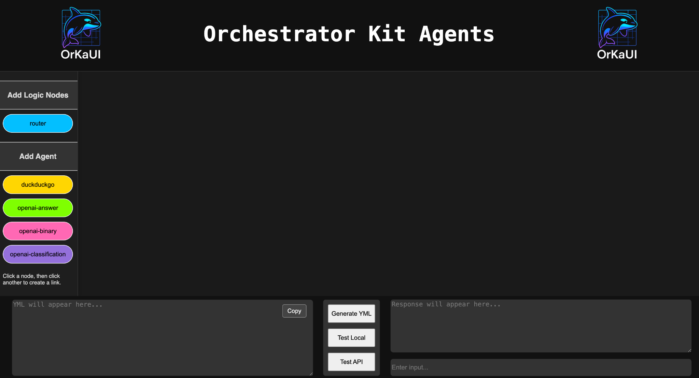
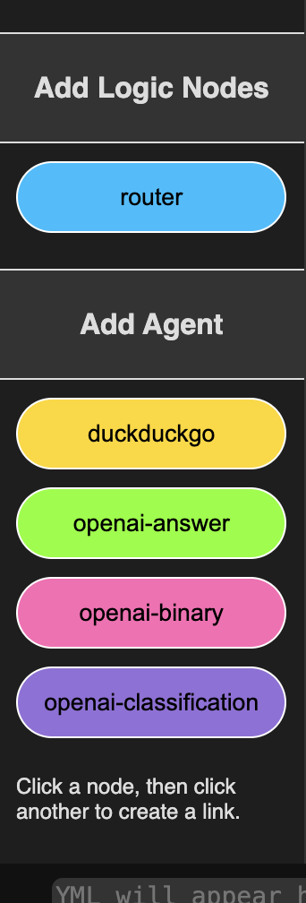
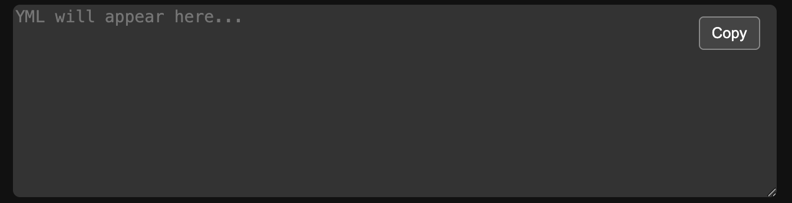
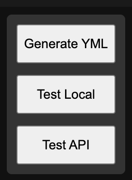
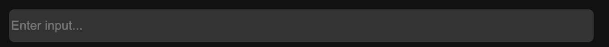

[📘 Getting Start](./getting-started.md) | [🤖 Agent Types](./agents.md) | [🔍 Architecture](./architecture.md) | [🧠 Idea](./index.md) | [OrKaUI](./OrKa_UI_Getting_Started_With_Images.md)

# Getting Started with OrKa UI 🚀

OrKa UI is a no-code visual tool that lets you build intelligent agent workflows and export them to YAML with a single click. It's built for developers, tinkerers, and product minds who want to orchestrate AI cognition visually.

---

## 🧠 What is OrKa?

OrKa (Orchestrator Kit Agents) allows you to visually compose **modular agents** and **logic nodes** (like routers) to define how cognitive workflows behave. Every agent has a purpose, every connection defines logic.

---

## ⚙️ How to Use OrKa UI (Step-by-Step)

### 1. Launch the App

> Open OrKa UI in your browser or localhost. You'll be greeted with a dark canvas and a sidebar to your left.

---

### 2. Add Agents and Logic
</img>

#### 👉 Add Logic Nodes
- Click on the **Router** button under "Add Logic Nodes".
- A logic node is used to control conditional execution — think of it like an `if` statement for cognition.

#### 👉 Add Agent Nodes
- Choose from:
  - `duckduckgo` (search agent)
  - `openai-answer` (LLM-based text generation)
  - `openai-binary` (binary classification)
  - `openai-classification` (multi-option classification)
- These appear in vibrant colors on your canvas.

---

### 3. Link Nodes

- Click on any agent node, then click on a second to create a directional link.
- Routers can link to up to 2 children depending on decision conditions.
- Use links to define execution flow.

---

### 4. Write Prompts & Settings

- Select a node to edit its configuration in the right-side panel.
- Add:
  - prompts
  - classification options
  - router logic (`decision_key`, routing map)

---

### 5. Generate the YAML
</img>
- Click `Generate YAML` on the bottom right.
- Your YAML spec will appear in the center panel.
- Click **Copy** to use it anywhere — for running in OrKa backend or sharing.

---

### 6. Test It
</img>
</img>
- **Enter and Input**: Add a question a task or a fact based on your workflow
- **Test Local**: Run it on your local backend (OrKa API).
- **Test API**: Sends the built graph to a hosted endpoint.

---

## 💡 Tips

- Routers are the brain: they determine path based on logic.
- Nodes are reusable. Tweak prompts until your cognition feels right.
- Export YAML and use it with OrKa Core or anywhere YAML-based flows are parsed.

---

## 📦 What's Next?

- Add memory support
- Visual debug paths
- Branching logic + nested flows
- Hosted orchestration

---

Made with 🧠 by [Marco Somma](https://github.com/marcosomma)

> Feedback welcome.

[📘 Getting Start](./getting-started.md) | [🤖 Agent Types](./agents.md) | [🔍 Architecture](./architecture.md) | [🧠 Idea](./index.md) | [OrKaUI](./OrKa_UI_Getting_Started_With_Images.md)